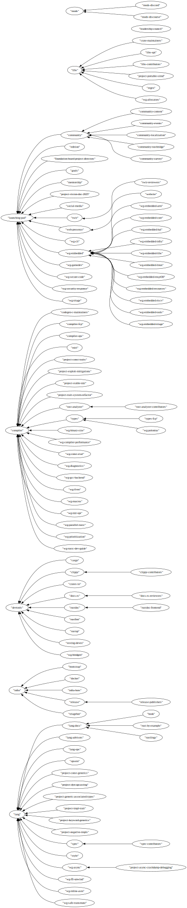

# rust-project-structure

Visualizing relationship between teams as per [rust-lang/team].

It's possible to upstream this to [rust-lang/team] as a `cargo run` command of course, but it's a lot of maintenance complexity and extra dependencies for a very niche use case, so no.

[rust-lang/team]: https://github.com/rust-lang/team/

## Example

```bash
$ cargo run -- -t $PATH_TO_TEAMS_CHECKOUT > subteam_of.dot
```

Arrows indicate "subteam of" relationship.


